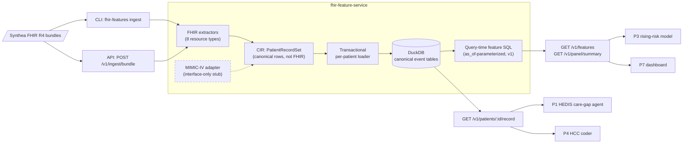

# fhir-feature-service

Ingests Synthea FHIR R4 patient bundles into canonical clinical-event tables and serves leakage-free, point-in-time patient features from DuckDB — the data foundation for a value-based-care analytics portfolio.

[](https://github.com/thiagobandeira1/fhir-feature-service/actions/workflows/ci.yml)
[](LICENSE)
[](pyproject.toml)
[](https://github.com/astral-sh/ruff)

## What this is

The foundation service (P6) of a 7-repo value-based-care portfolio. It ingests Synthea-generated FHIR R4 bundles — one patient per bundle — and normalizes them into a two-layer DuckDB model: canonical clinical-event tables (the event-level truth) plus a versioned patient feature record computed **at query time** for any `as_of` date, so a feature can never see an event dated after it. Four downstream repos consume it over HTTP: a HEDIS care-gap agent, a rising-risk prediction model, an HCC coding assistant, and a panel dashboard. A `SourceAdapter` boundary (canonical rows, not FHIR) keeps the door open for a local-only MIMIC-IV adapter, which ships here interface-only.

## Architecture



## Consumer contracts

| Consumer | Endpoint | What they get |
|---|---|---|
| **P1** HEDIS care-gap agent | `GET /v1/patients/{id}/record` | Event-level truth: conditions, observations (BP/HbA1c), procedures, meds, immunizations with codes + dates |
| **P3** rising-risk model | `GET /v1/features?as_of=` (paged) | Leakage-free point-in-time feature rows at any historical `as_of` |
| **P4** HCC coder | `GET /v1/patients/{id}/record` (`claim_diagnoses` section) | Claims-shaped diagnosis history: code + service-date proxy + sequence |
| **P7** dashboard | `GET /v1/panel/summary` | One fixed panel rollup: demographics, prevalence, utilization |

Full endpoint reference: [docs/SPEC.md](docs/SPEC.md) §4 · machine-readable feature contract: `GET /v1/features/schema` · [docs/openapi.json](docs/openapi.json).

## Quickstart (<10 minutes, Windows/macOS/Linux)

Requires [uv](https://docs.astral.sh/uv/) and Python 3.12.

```sh
uv sync
uv run fhir-features init-db
uv run fhir-features ingest synthetic/samples
uv run fhir-features serve
```

The server binds `127.0.0.1:8000` by default (deliberate — no auth/TLS in v1; configure via `FF_*` env vars). In a second terminal:

```sh
curl http://127.0.0.1:8000/healthz
curl "http://127.0.0.1:8000/v1/patients?limit=5"
curl "http://127.0.0.1:8000/v1/patients/939eea26-a679-2564-5cf9-c0fd557beefc/features?as_of=2025-12-31"
curl http://127.0.0.1:8000/v1/features/schema
```

The third call returns the committed diabetic persona at a pinned date — excerpt of the real response:

```json
{
  "feature_version": "v1",
  "valuesets_version": "2026.08",
  "features": {
    "patient_id": "939eea26-a679-2564-5cf9-c0fd557beefc",
    "as_of": "2025-12-31",
    "age_years": 75,
    "has_diabetes": true,
    "latest_sbp": "123.000000",
    "latest_dbp": "83.000000",
    "latest_hba1c": "7.500000",
    "statin_authored_365d": true,
    "encounters_365d": 3
  }
}
```

Interactive OpenAPI docs at <http://127.0.0.1:8000/docs>. A multi-stage [Dockerfile](Dockerfile) is included (image build deferred; CI does not build it yet).

## Design highlights

- **Leakage-freedom by construction** — features are `as_of`-parameterized SQL over event tables with date-only semantics (an event counts iff its source-local date ≤ `as_of`; clinical/verification status is stored but never consulted). Proven by golden tests at two pinned dates with explicit anti-leakage assertions.
- **Same-panel BP pairing** — `latest_dbp` comes from the same `85354-9` panel as `latest_sbp`, never independently latest.
- **Code-keyed component flattening** — `Observation.component` becomes child rows with ids keyed by component *code* (`<parent>#<code>`), so re-ingest is stable and SBP/DBP are directly queryable.
- **Idempotent, replayable ingestion** — sha256 no-op detection, transactional per-patient replace (no orphans), raw bundle retention, and a `reparse` command to rebuild canonical tables after extractor fixes.
- **In-wheel adapter conformance suite** — `fhir_features.testing.AdapterConformanceSuite` ships inside the package; the future MIMIC repo installs this wheel and must pass the identical suite the Synthea adapter passes in CI.
- **Deny-by-default logging** — structlog with an allowlist of loggable keys, backed by a sentinel-name log-safety test asserting no names/birthdates/paths ever reach logs.
- **RFC 9457 errors** — `application/problem+json` everywhere, never echoing resource content.

## Data & compliance

- **This repo is Synthea-only and fully synthetic.** No real patient data exists anywhere in it — see [synthetic/samples/PROVENANCE.md](synthetic/samples/PROVENANCE.md). Safe to commit and to process with cloud LLMs.
- **MIMIC-IV is interface-only**: a typed `Protocol` stub plus the conformance suite. MIMIC data is never committed and never sent to cloud LLMs (PhysioNet DUA); the stub validates that its config paths resolve outside the repo tree.
- **HEDIS/HCC measure logic is deliberately absent** — this service serves descriptive fields only; verdicts (`bp_controlled`, `on_statin`, …) belong to the consumers that own those semantics.
- **Value sets are demo-grade**: curated from public code systems (SNOMED CT, LOINC, RxNorm, CVX), committed as versioned JSON. They are not NCQA/VSAC licensed sets, and no CPT codes are included (AMA licensing).

## Testing

`uv run pytest` — **250 tests passing** (coverage gate ≥ 85% in CI), layered as:

1. **Unit** — date parsing (partial precisions, local-date-before-UTC-shift), code normalization, bundle reference resolution, and per-resource extractors (incl. BP component flattening).
2. **Contract/conformance** — the in-package adapter suite run against the Synthea adapter over the committed personas.
3. **Integration/API** — ingest idempotency and reparse end-to-end; every endpoint's happy and problem+json error paths over a temp DuckDB; migration checksum guards.
4. **Golden anti-leakage** — feature rows at two pinned `as_of` dates versus committed JSON, asserting an earlier `as_of` cannot see later admissions, statins, or condition onsets.

Reference docs: [docs/SPEC.md](docs/SPEC.md) · [docs/adr/](docs/adr/) · [docs/feature_dictionary.md](docs/feature_dictionary.md) · [docs/openapi.json](docs/openapi.json)

## Limitations (known and accepted)

- **DuckDB is single-writer** — the server runs one uvicorn worker; read-only DuckDB attach is the sanctioned local bulk path (ADR-0001).
- **Query-time features re-scan per request** — fine at portfolio scale; materialized snapshots are the documented future optimization for MIMIC-sized volume.
- **Synthea codes are SNOMED-heavy** — real HEDIS/HCC pipelines speak CPT/ICD-10-CM; the claims realism here is a proxy (`claim_diagnoses` resolved from FHIR Claims).
- **Medication features are recency proxies** — `statin_authored_365d` reflects order recency, not adherence (Synthea has no reliable stop dates).
- **Year/month date precision is imputed optimistically** (Jan-1), kept visible via `date_precision`.

## License

[MIT](LICENSE)
